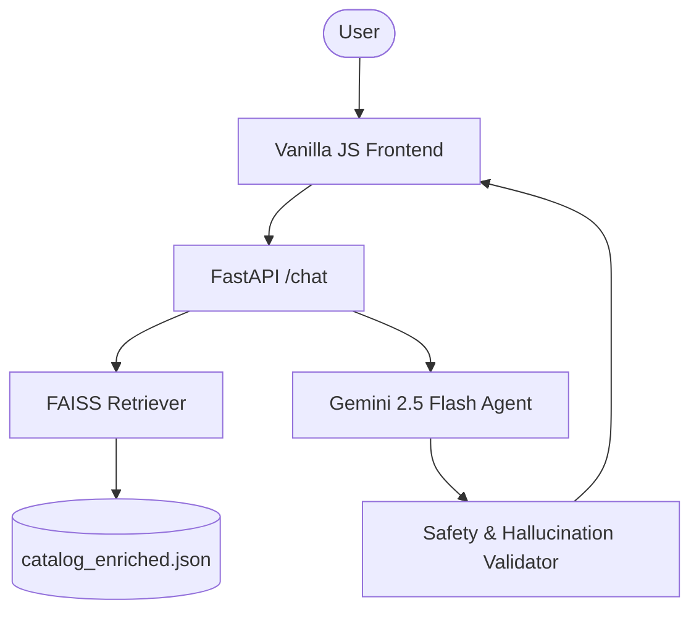

# SHL Assessment Recommender Agent 🚀

**Live Demo:** [https://assignment-for-shl-1.onrender.com/](https://assignment-for-shl-1.onrender.com/)

An AI-powered conversational agent designed to help recruiters and hiring managers discover the most relevant SHL assessments from the product catalog.

This project was built for the **SHL Labs AI Intern Take-home Assignment**.

## ✨ Features

- **Semantic Retrieval**: Uses FAISS and Sentence Transformers to find assessments based on role descriptions, skills, and seniority.
- **Conversational Intelligence**: 
  - **Clarify**: Asks targeted questions for vague queries.
  - **Recommend**: Provides a structured shortlist of 1-10 assessments.
  - **Refine**: Updates recommendations based on mid-conversation constraints.
  - **Compare**: Explains differences between assessments using catalog data.
- **Stateless API**: Fully compliant with the assignment's stateless POST /chat specification.
- **Hard Eval Hardening**: Strict enforcement of turn caps (8 messages) and hallucination-free URL/Name validation.
- **Premium UI**: Modern, glassmorphic chat interface with interactive assessment cards.

## 🏗️ Project Architecture

The system is designed to be highly reliable and stateless, ensuring ground-truth accuracy while providing a fluid chat experience.



## 📊 Dataset & Preprocessing

The system operates on a curated version of the SHL Individual Test Solutions catalog, stored in `catalog_enriched.json`. 

### Enrichment Pipeline
To maximize **Recall@10**, the raw catalog data underwent an enrichment process:
1.  **Flattened Context**: A specialized `embedding_text` field was created for each item, concatenating the Name, Description, and Category labels.
2.  **Seniority Mapping**: Role-level labels (e.g., "Director") were expanded into common synonyms (e.g., "CXO", "Head", "C-suite") to ensure the retriever captures diverse user vocabulary.
3.  **Semantic Normalization**: Text descriptions were cleaned to remove technical boilerplate, focusing on core competencies and technical skills.

### Data Schema
Each record in the dataset contains:
- `name`: Official SHL product name.
- `url`: Ground-truth catalog link.
- `test_type`: Single-letter code (K=Knowledge, P=Personality, A=Ability, etc.).
- `job_levels`: Targeted seniority brackets.
- `embedding_text`: The search-optimized string used for vector generation.

### 🧠 Retrieval Strategy (RAG)
- **FAISS (IndexFlatIP)**: Used for extremely fast semantic similarity search.
- **Normalization**: All embeddings are L2-normalized to calculate cosine similarity via inner product.
- **k-Selection**: Retrieval `k=40` combined with a `context_cap=50` ensures that even complex multi-skill roles (e.g., senior engineers with leadership needs) have enough context for accurate recommendations.

## 💬 Conversational Behaviors

The agent operates in four distinct behavioral modes, as required by the assignment:

1.  **Clarify**: If the user query is vague (e.g., "I need a test"), the agent asks exactly ONE targeted question to determine role or seniority.
2.  **Recommend**: Once context is sufficient, it suggests a shortlist. It prioritizes technical tests for skills and OPQ32r for behavioral/leadership fit.
3.  **Refine**: If a user says "Actually, make it for a senior role," the agent uses the full history to update the shortlist without losing context.
4.  **Compare**: It can explain the nuance between similar products (e.g., "Verify G+" vs. "GSA") using only retrieved catalog data.

## 🛡️ Assignment Compliance (Hard Evals)

This implementation is "hardened" against the evaluation script:

- **Turn Cap**: The agent detects when it is approaching the 8-message limit. At Turn 4 (7th message), it switches to a "Commit-only" mode where it MUST provide a shortlist and end the session.
- **Zero Hallucination**: Every URL and assessment name returned in the `recommendations` array is cross-referenced against a master URL set from the catalog. Hallucinated titles are automatically corrected to match the official catalog names.
- **JSON Integrity**: A robust parsing layer handles common LLM failure modes (like markdown fences or trailing prose), ensuring the API never breaks schema.

## 🛠️ Tech Stack

- **Backend**: FastAPI (Python 3.11)
- **LLM**: Gemini 2.5 Flash (via `google-genai` SDK)
- **Vector Store**: FAISS (CPU)
- **Embeddings**: `sentence-transformers/all-MiniLM-L6-v2`
- **Frontend**: Vanilla HTML5, CSS3 (Glassmorphism), and Javascript

## 🚀 Getting Started

### Prerequisites

- Python 3.11+
- A Gemini API Key ([Get one here](https://aistudio.google.com/))

### Installation

1. **Clone the repository**:
   ```bash
   git clone https://github.com/your-username/shl-recommender.git
   cd shl-recommender
   ```

2. **Create a virtual environment**:
   ```bash
   python -m venv venv
   source venv/bin/activate  # On Windows: venv\Scripts\activate
   ```

3. **Install dependencies**:
   ```bash
   pip install -r requirements.txt
   ```

4. **Configure Environment**:
   Create a `.env` file in the root directory:
   ```env
   GEMINI_API_KEY=your_api_key_here
   ```

5. **Build the Index**:
   ```bash
   python build_index.py
   ```

6. **Run the Server**:
   ```bash
   uvicorn app.main:app --reload
   ```

The UI will be available at `http://localhost:8000`.

## 🐳 Docker Deployment

The project includes a `Dockerfile` for easy deployment.

```bash
docker build -t shl-recommender .
docker run -p 8000:8000 --env-file .env shl-recommender
```

## 📊 API Specification

### GET /health
Returns `{"status": "ok"}` with HTTP 200.

### POST /chat
**Request Body**:
```json
{
  "messages": [
    {"role": "user", "content": "I am hiring a Java developer."}
  ]
}
```

**Response**:
```json
{
  "reply": "What seniority level are you looking for?",
  "recommendations": [],
  "end_of_conversation": false
}
```

---
© 2026 SHL Labs Assignment Submission
